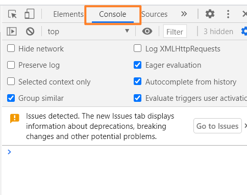
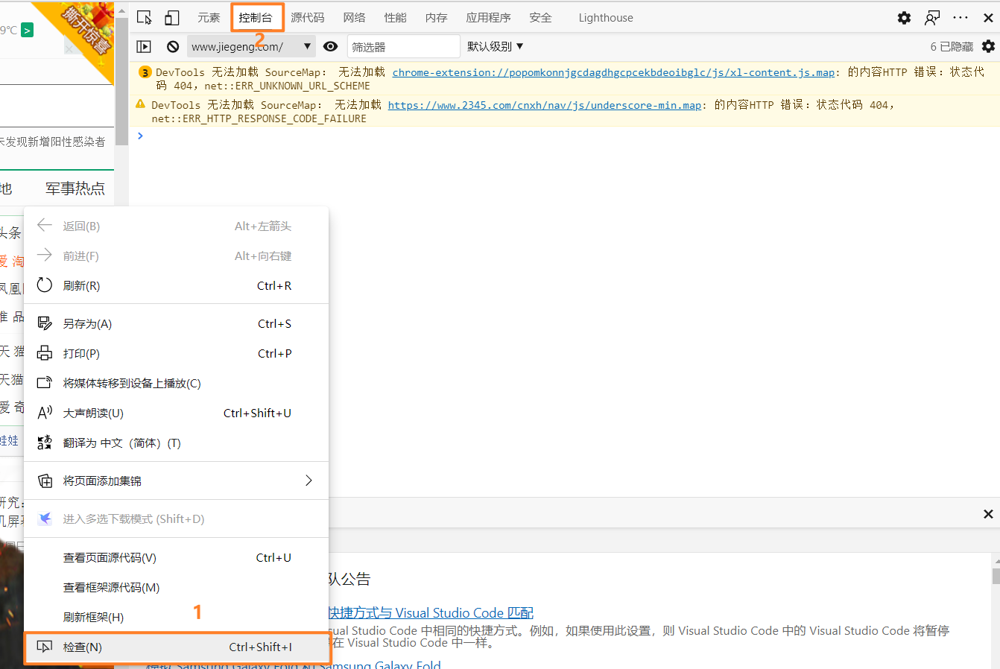

# 前言

---

## 1.js的错误

### 1.1 try...catch...finnally...

```javascript
try{
    //异常的抛出
}
catch(e){
    //异常的处理
}
finally{
    //结束处理
}
```

### 1.2 throw

throw允许我们自定义错误，创建并抛出这个异常。

```javascript
throw expression
```

## 2.js的调试

无论是编写什么语言的代码，在正式的运行成功前总要经过若干次的调试，而如何调试是一个技术活，好在我们也有一些办法。

### 2.1 console调试台

你可以使用console.log()打印信息并在浏览器的控制台查看。

chrome：



microsoft edge



### 2.2 debugger

你还可以使用debugger用于调试。

```javascript
var x = 15 * 5;
debugger;
document.getElementById("demo").innerHTML = x;
```

页面显示：


## 3.js变量提升

### 3.1js的变量可以先使用后声明

```javascript
a=3;  //a赋值3
elem=document.getElementById("demo");
elem.innerHTML=a;
var a;  //声明a

//而一般是这样的
var a=3;  //声明的时候同时赋值
elem=document.getElementById("demo");
elem.innerHTML=a;
//但是这样是不允许的
elem=document.getElementById("demo");
elem.innerHTML=a;
var a=3;  //声明和赋值都放在了最后不可以！！！你只能是第一第二两种方式的一种。
```

==js的严格模式下不可以使用变量提升==

## 4.js的严格格式

为什么使用，官方说明指出javascript在原来的设计有些不严谨之处，为了消除这种不严谨和怪异的行为，就有了严格模式。
严格模式也能保证代码的安全性，提升编译器的编译效率。

严格模式的限制

```javascript
//1.不允许使用未定义的变量
"use strict"
x=3.14;  //wrong

//2.不允许删除变量或者对象
"user strict"
var x=3.14;
delete x; //wrong

//3.不允许删除函数
"use strict"
function fun1(a,b){
    return a+b;
}
delete fun1;  //wrong

//4.不允许变量同名
"use strict"
function fun1(a,a){}  //wrong

//5.不允许使用八进制
"use strict"
var x=010; //wrong

//6.不允许使用转义字符
"use strict"
var x="\"David\"";  //wrong

//7.不允许对只读属性赋值
"use strict";
var obj = {};
Object.defineProperty(obj, "x", {value:0, writable:false});
obj.x = 3.14;  //wrong

//8.不允许对一个使用getter方法读取的属性进行赋值
"use strict";
var obj = {get x() {return 0} };
obj.x = 3.14;  //wrong

//9.不允许删除一个不允许删除的属性
"use strict";
delete Object.prototype;  //wrong

//10.变量名不能使用 "eval" 字符串
"use strict";
var eval = 3.14; //wrong

//11.变量名不能使用 "arguments" 字符串
"use strict";
var arguments = 3.14;  //wrong

//12.不允许使用以下这种语句
"use strict";
with (Math){x = cos(2)}; //wrong

//13.由于一些安全原因，在作用域 eval() 创建的变量不能被调用
"use strict";
eval ("var x = 2");
alert (x); //wrong

//14.this指针的限制
```

## 5.js表单验证

==为了更好地理解本部分地内容，应该回顾html中关于表单的内容，详见day04中的html表单==

js表单验证可以验证表单的存在与否，如果不存在，就弹出信息阻止表单的提交。

可以简要参考表单验证1.html文件中的示例。

### 5.1 js表单验证输入的数字

参考 数字校验.html。
在例子中，可用isNaN()内置方法判断输入的是否为数字，再辅助一些比较判断，就能较好地实现目的。

### 5.2 HTML自动表单验证

HTML在提交时能自动验证。
参考 自动验证.html

### 5.3 数据验证的说明

在前端开发中，开发者总希望用户能输入符合条件的数据，但符合条件的这个要求是不能施加于用户本身的，只能是由代码根据事先规定好的规则去检测用户传入的输入信息，一般来说，有这几点：
1.用户是否输入了？（字段是否为空）
2.用户输入的数据是否格式准确，即是否合法？
3.用户是否输入了正确类型的数据？如只能输入数字的地方却输入文本？或者文本中输入数字？
而检验数据的时期又分为两类：一是在浏览器中校验，即在html页面引入的脚本中校验;二是数据发送到服务端后由服务端进行校验，再返回校验结果。

### 5.4 HTML约束验证

约束验证（constraint validation) 是HTML5新加入的，是表单提交的时候在浏览器实现验证的一种算法。

#### 5.4.1 约束验证中htMl输入的属性

```javascript
disabled // 规定输入的对象是否可用
max  // 规定输入元素的最大值
min //  规定输入元素的最小值
pattern //  规定输入元素的模式
required  // 规定输入的元素字段是必须的
type  // 规定输入元素的类型
```

