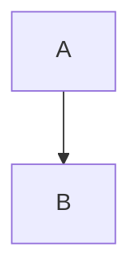

# 前言

学习了js的表单验证，发现很多东西还是基于html表单上的，因此，又花了一点时间把html和html5有关的表单知识全部过了一遍。

---

## 1.html表单简要

html 表单主要是用来收集用户的输入信息，并发送到服务端。
通俗一点来说，就是我要你提交信息给我，我呢，事先规定好统一的要求，你按照要求给我信息。
实际中，每次登录、或者你学校管理系统的修改个人信息资料等等都是表单，而表单中输入的数据会有不同的类型和选型，同时，也伴随着数据格式的校验。

## 2.简单的表单展示

请参考测试用例的html表单.html中的示例。

## 3.input标签的type属性

常用的type属性有：
1.text    #文本
2.password  #密码
3.radio   # 单选按钮
4.checkbox  #复选框
5.submit  #提交按钮

