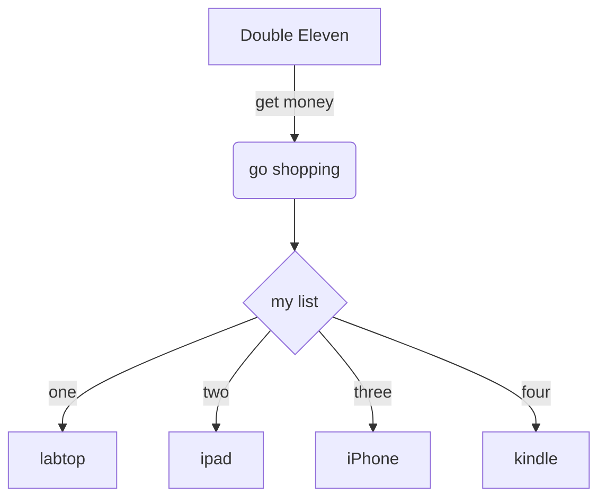
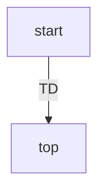
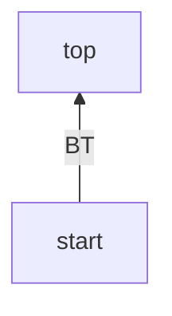
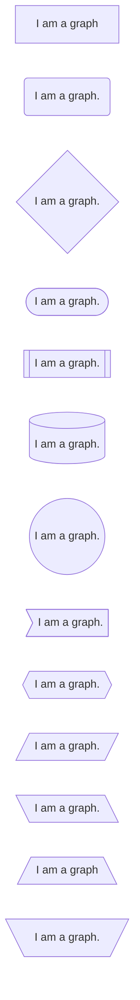
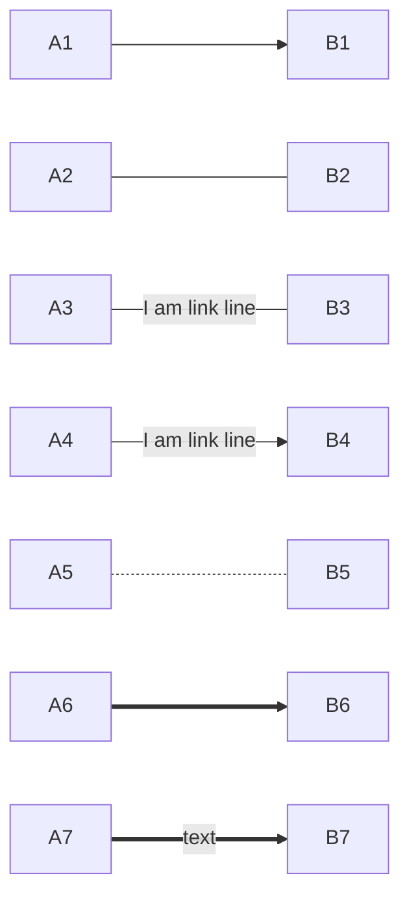
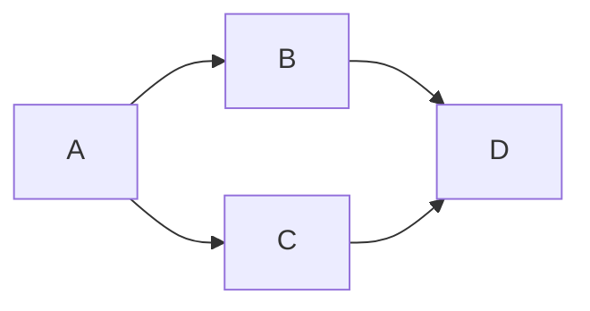
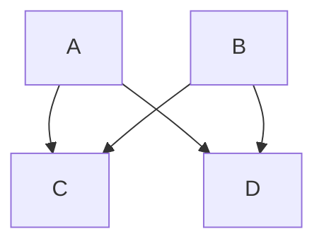
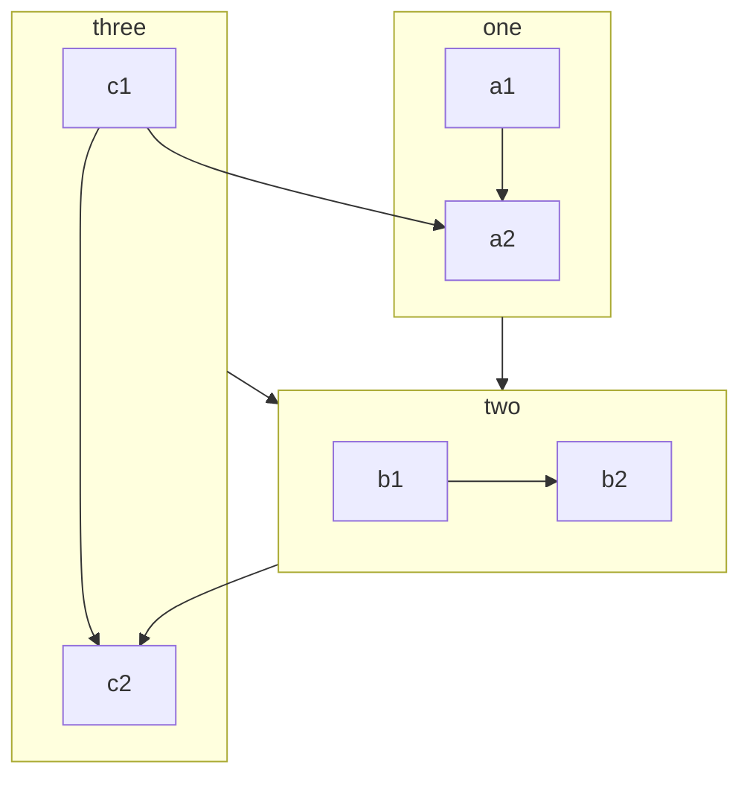

# mermaid

让我写点英文装装逼格。

在markdown中画出想要的流程图、时序图
You can draw all flowcharts and suquece diagrams you want in the markdown.

---

## 1.flowcharts

>demo1 simple flowchart

>demo2 different syntax

Please observe the effect of different syntaxs.

>demo3

In this demo, you can see the difference of `TD`,`TB`,`BT`,`RL`,and `LR`.

>demo4
In this demo, you will see the difference of nodes and shapes by difference syntax.

the link between two elements.

It is possible declare many links in the same line as per below:

It is also possible to declare multiple nodes links in the same line as per below:

